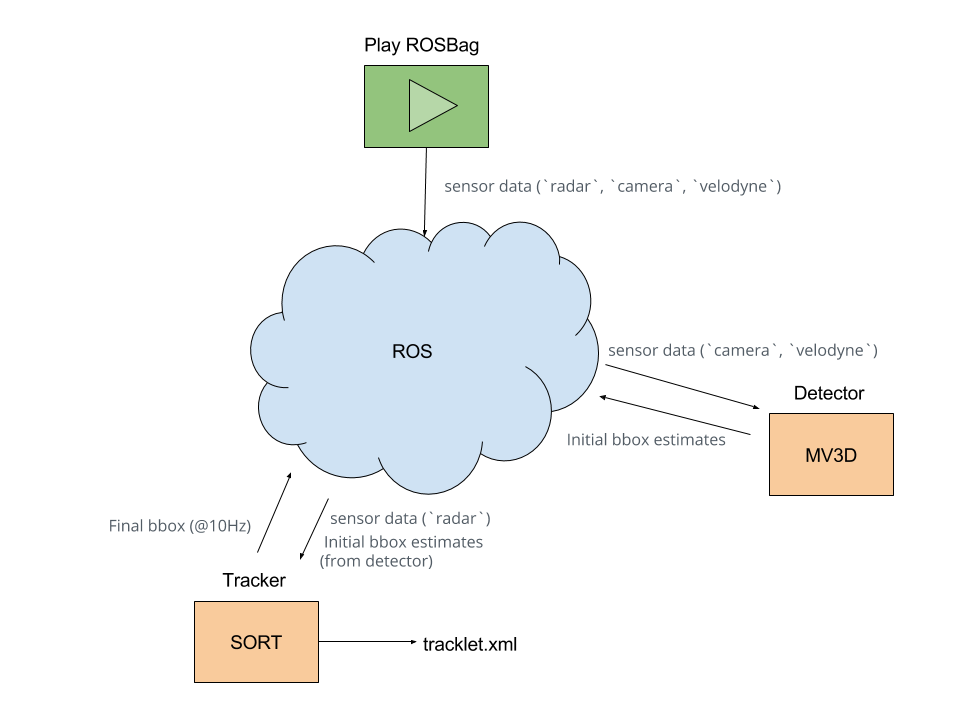

# Purpose
This document describes the final submitted codes for team **"In It To Win It"** for the [Udacity Self-Driving Car Challenge 2017](https://challenge.udacity.com/).

# System Settings and Dependencies
* Ubuntu 14.04
* ROS Indigo
* ros-indigo-velodyne
* Python3.5.3(For MV3D neural nets)
* Python2.7.13(For ROS node related)
* Tensorflow-1.1
* Keras


# Background and Overview
Our ROS implementation mainly consists of three nodes:
* detector(give predictions from MV3D neural net)
* ped_tracker(for pedestrian tracking)
* car_tracker(for pedestrian tracking)
saved as two ROS packages with the same names.



## Detector Node
The detector node implements our main detection algorithm based on the [Multi-View 3D Object Detection Network for 
Autonomous Driving](https://arxiv.org/abs/1611.07759) algorithm, using a tuned model with a set of pre-trained 
weights (see [here](./docs/README_MV3D.md)). This algorithm uses the Lidar top-view, front-view, and the camera images
 to detect the 
first 
estimation of the bounding boxes.

## Tracker Node
The tracker node implements Kalman filter to track the target obstacles. It uses the [SORT](https://github.com/mandarup/multi-object-tracking) algorithm for multi-object tracking to remove false positives. In addition, it also implements Kalman-based sensor fusion to include mesurement updates from radar messages. Furthermore, this node is responsible for producing a detection output in a timeframe required by the competition (10Hz), irrespective of the sensors' measurement frequencies and MV3D detection processing time. 

# Training of MV3D Network
To obtain the set of weights, first train the MV3D network as follows:

- First trained our rpn net therefore it can extract lidar top view features nicely and gives accurate proposals.
- Then froze the RPN(regional proposal net) and train rgb feature extractor(already used pretrained weights) and fuse 
net which described inside the paper. 

# Setup

## Note: Make sure the following files are executable 
(use `chmod +x` if some script cannot run, please make sure that
 script has execute permissions):
..* `~/ros/src/detector/scripts/predict_rpc.py`
..* `~/ros/src/detector/scripts/pipeline.py`
..* `~/ros/src/tracker/scripts/tracker.py`


## Download the neural net weights, and put it under the right directory:
A. Download the model weights [here](https://www.dropbox.com/sh/8g64ho1tgpvja58/AABLVoA20vZd7Z2Ab_aemVZ5a?dl=0)

B. Put the zip file under ros/src/detector/MV3D/checkpoint directory

C. After unzip the zipped file, it will show 2 directories: `car` and `ped`. And its structure will be like the 
following: 
```
checkpoint/
├── car
│   ├── fusion
│   │   ├── checkpoint
│   │   ├── fusion.data-00000-of-00001
│   │   ├── fusion.index
│   │   └── fusion.meta
│   ├── image_feature
│   │   ├── checkpoint
│   │   ├── image_feature.data-00000-of-00001
│   │   ├── image_feature.index
│   │   └── image_feature.meta
│   └── top_view_rpn
│       ├── checkpoint
│       ├── top_view_rpn.data-00000-of-00001
│       ├── top_view_rpn.index
│       └── top_view_rpn.meta
└── ped
    ├── fusion
    │   ├── checkpoint
    │   ├── fusion.data-00000-of-00001
    │   ├── fusion.index
    │   └── fusion.meta
    ├── image_feature
    │   ├── checkpoint
    │   ├── image_feature.data-00000-of-00001
    │   ├── image_feature.index
    │   └── image_feature.meta
    └── top_view_rpn
        ├── checkpoint
        ├── top_view_rpn.data-00000-of-00001
        ├── top_view_rpn.index
        └── top_view_rpn.meta

8 directories, 24 files

```

## create the ros workspace in the ros dir
```
$ catkin_make
```
## source ros env
```
$ source devel/setup.bash
```
## install all dependencies:

Python 2 dependency(ROS node related.):

```
pip install em
pip install numpy
pip install opencv-python
pip install pyyaml
pip install matplotlib
pip install easydict
pip install numba
conda install pyqt=4
pip install filterpy
pip install sklearn
```

For more dependencies, please refer to: 
https://docs.google.com/document/d/1uY3EpkE5j5dA8FoAxh0FGwRQ9Ly1Y25LjobJo8I1Rgk/edit
or refer to our yaml files. 

### go to catkin_ws/src/detector/MV3D/src directory
```
# sudo chmod +x ./make.sh (if cannot make)
./make.sh

```

If you encounter issues running the ./make.sh script, please go to [here](./docs/README_MV3D.md) for reference. 


1. Run the python 3(Please note it should be python 3, for other parts, we use python2.7) predict service

```
cd catkin_ws/src/detector/scripts/run_model.py
# for pedestrain detection, run the following line
$ python ./run_model.py -m ped
# for car detection, run the following line
$ python ./run_model.py -m car

```

4. run all from ros launch
```
# please change the bag_DIR and bag parameters according to your local environment.
# for pedestrain detection, run the following roslaunch

roslaunch ped.launch  bag:=ped_test rate:=0.3 bag_DIR:=/media/stu/hdd1_1t/competition_data/didi_dataset/round2/test_ped
# for car detection, run this line instead
roslaunch car.launch  bag:=ford01 rate:=0.3 bag_DIR:=/media/stu/hdd1_1t/competition_data/didi_dataset/round2/test_car
```


## 1. Run detector node: 

### A. for pedestrian obstacle
 
run ROS launch file for pedestrian
 
```
roslaunch launch/[TO-ADD]
```

### B. for car obstacle

run ROS launch file for cars
 
```
roslaunch launch/[TO-ADD]
```


# Output
The final bounding box output will be published by the `tracker` node in the form of `PoseArray` message for obstacle position and orientation.

Once one loop of the rosbag playback has completed (frame index restarts from beginning), a tracklet file will be generated and saved in the same folder.

 
---


